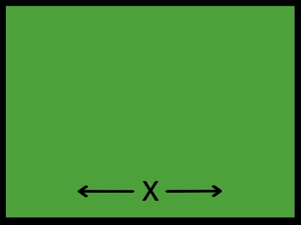

La classe `xcenter` dans ton fichier `style.css` aligne les éléments au centre horizontalement.

La classe `ycenter` dans ton fichier `style.css` aligne les éléments au centre verticalement.

Si tu appliques les classes `xcenter` et `ycenter`, tu alignes les éléments au centre à la fois horizontalement et verticalement.

--- code ---
---
language: html
filename: index.html
line_numbers: false
---
      <section class="wrap">
        

          
Lorem ipsum

        

        

          
Lorem ipsum

        

        

          
Lorem ipsum

        

      </section>

--- /code ---

<iframe src="https://editor.raspberrypi.org/fr-FR/embed/viewer/web-x-y-center" width="400" height="600" frameborder="0" marginwidth="0" marginheight="0" allowfullscreen> </iframe>
