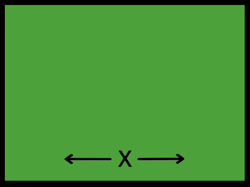

The `xcenter` class in your `style.css` file aligns items to the centre horizontally.

The `ycenter` class in your `style.css` file aligns items to the centre vertically.

If you apply both the `xcenter` and `ycenter` classes, you align items to the centre both horizontally and vertically.



## --- code ---

language: html
filename: index.html
line_numbers: false
--------------------------------------------------------

```
  <section class="wrap">
    <div class="xcenter tile tertiary">
      <p>Lorem ipsum</p>
    </div>
    <div class="ycenter tile secondary">
      <p>Lorem ipsum</p>
    </div>
    <div class="xcenter ycenter tile tertiary">
      <p>Lorem ipsum</p>
    </div>
  </section>
```

\--- /code ---

<iframe src="https://editor.raspberrypi.org/en/embed/viewer/web-x-y-center" width="400" height="600" frameborder="0" marginwidth="0" marginheight="0" allowfullscreen> </iframe>
